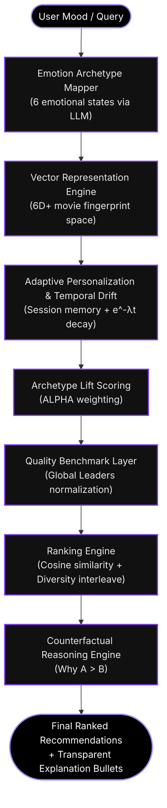

🎬 FILMBOX — 8-LAYER INTELLIGENCE PIPELINE
🧱 SYSTEM OVERVIEW

FilmBox has evolved from a deterministic recommender into a mature, **8-layer Emotion-Aware Recommendation System**. It mimics the capabilities of tier-1 streaming platforms by incorporating temporal taste drift, session memory, and transparent counterfactual reasoning.

### 🧠 System Architecture

### 🧬 The 8 Intelligence Layers
1. **Intent Modeling**: LLM processes natural language into a 6D emotional query vector.
2. **Semantic Representation**: Movies are mapped to 6D emotional embeddings.
3. **Vector Similarity**: Core ranking utilizing cosine similarity.
4. **Personalization**: User interaction centroid tracking implicit preferences (likes, saves, clicks).
5. **Temporal Adaptation**: Exponential decay (`λ=0.035`) organically drifts tastes over time.
6. **Adaptive Confidence**: Dynamic BETA scaling shifts weighting smoothly from cold-start to tailored profiles.
7. **Transparent Reasoning**: Foundational contribution explanations for user trust.
8. **Counterfactual Reasoning**: Advanced "winner vs runner-up" comparative intelligence logic.

---
🎯 Objective

Create a stable relational metadata database.

No recommender yet.

📦 Data Model

Tables:

movies

movie_id (PK)

title

release_year

runtime

popularity

vote_average

vote_count

genres

genre_id (PK)

name (unique)

movie_genres

movie_id (FK)

genre_id (FK)

PK (movie_id, genre_id)

keywords

keyword_id (PK)

name (unique)

movie_keywords

movie_id (FK)

keyword_id (FK)

PK (movie_id, keyword_id)

🔗 Relationships
movies (1) — (∞) movie_genres (∞) — (1) genres
movies (1) — (∞) movie_keywords (∞) — (1) keywords

All FK columns indexed.

🔄 Data Pipeline (Phase 1)
Raw TMDb CSV
   ↓
Data Cleaning
   ↓
Deduplicate Genres
   ↓
Deduplicate Keywords
   ↓
Insert Movies
   ↓
Insert Junction Tables
   ↓
Validate Foreign Keys

End State:

✔ No orphan rows
✔ 5k–10k clean movies
✔ ER diagram documented

🟡 PHASE 2 — SCORING ENGINE

This is the intellectual core.

Layer 1 — Base Scoring

Purpose:
Rank movies globally based on quality + visibility.

Normalization Pipeline

For each numeric feature:

min-max normalize → range [0, 1]

For vote_count:

log(1 + vote_count)
then normalize
Base Score Formula
base_score =
    0.4 * normalized_vote_average
  + 0.3 * normalized_popularity
  + 0.3 * log_scaled_vote_count

Output:
base_score ∈ [0, 1]

This ranking is emotion-neutral.

Layer 2 — Emotional Archetype Engine

Input:

movie metadata

selected archetype

Output:
emotional_score ∈ [0, 1]

Emotional Scoring Pipeline
Check genre matches
   ↓
Check runtime conditions
   ↓
Check rating thresholds
   ↓
Check keyword signals
   ↓
Apply dampeners
   ↓
Clip to [0,1]
Example — Mind-Bending Pipeline
If genre in Sci-Fi/Mystery/Thriller → +0.30
If vote_average > 7.2 → +0.20
If runtime > 100 → +0.10
If keyword contains time/dream/parallel → +0.15
If genre Comedy → -0.15

Sum and clip.

Layer 3 — Blending Engine

Purpose:
Combine emotional alignment with base ranking.

Formula:

final_score = base_score + (0.35 * emotional_score)

Why additive?

Prevents ranking explosion

Maintains base quality signal

Emotion shifts ranking without distortion

Output:
final_score used for sorting.

🔵 PHASE 3 — API LAYER

Purpose:
Expose ranking engine cleanly.

Endpoint
GET /recommend?archetype=Mind-Bending
API Pipeline
Receive request
   ↓
Validate archetype (must be 1 of 6)
   ↓
Fetch movies from DB
   ↓
Compute base_score
   ↓
Compute emotional_score
   ↓
Compute final_score
   ↓
Sort descending
   ↓
Return Top N
Response Structure
{
  "archetype": "Mind-Bending",
  "results": [
    {
      "title": "...",
      "base_score": 0.62,
      "emotional_score": 0.71,
      "final_score": 0.87
    }
  ]
}

Explainable by design.

🟣 PHASE 4 — PRESENTATION LAYER

Purpose:
Human-facing interface.

Minimal UI Architecture
Dropdown (6 archetypes)
   ↓
API Call
   ↓
Render Movie Cards

Movie Card Contains:

Title

Year

Vote Average

Emotional Score (optional display)

No search engine.
No pagination.
No user accounts.

🧠 COMPLETE SYSTEM PIPELINE

Full end-to-end:

User selects archetype
   ↓
Frontend calls API
   ↓
API validates input
   ↓
DB fetches movie metadata
   ↓
Base scoring engine computes base_score
   ↓
Emotional engine computes emotional_score
   ↓
Blending engine computes final_score
   ↓
Sorted results returned
   ↓
Frontend renders list

Clean. Linear. Deterministic.

📁 FINAL PROJECT STRUCTURE
film_box/
│
├── backend/
│   ├── app.py
│   ├── db.py
│   ├── base_scoring.py
│   ├── emotional_archetypes.py
│   ├── recommender.py
│   └── models.sql
│
├── frontend/
│
├── data/
│
├── architecture/
│   ├── system_overview.md
│   ├── data_architecture.md
│   ├── scoring_architecture.md
│   ├── emotional_model_design.md
│   ├── api_contract.md
│   └── diagrams/
│
└── README.md
🔥 What Makes This “Advanced”

Not AI hype.

But:

✔ Normalized relational design
✔ Feature scaling strategy
✔ Log transformation reasoning
✔ Deterministic emotional modeling
✔ Controlled blending logic
✔ Clean separation of layers
✔ Explainable outputs

This is architecture maturity.
